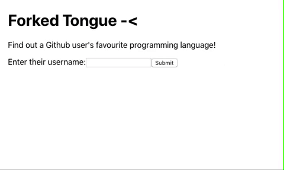

# Forked Tongue

Forked Tongue is a simple React app that returns a best guess of a given Github user's favourite programming language. 




## Getting started

### Prerequisites

[React](https://reactjs.org/)

### From Github

This app's Github repository is https://github.com/george-kirby/forked-tongue.

To access this code on your local machine from this Github repository, first *fork* this repository. Go to the top-right corner of the page and click **Fork**. 

Then, clone the resulting forked repository: 

1. Click the green "Clone or Download" button, then copy the https address to your clipboard. 
2. Navigate on your local machine to the folder you want to keep the app in, and run in terminal the command 
```$ git clone COPIED_ADDRESS ```
3. Navigate into the new directory. 

### On your local machine

In the app directory, run your package manager's start command, such as

```npm start```
or
```yarn start```

This will start the server, and Forked Tongue will be available to view on http://localhost:3000.

## Using the app

Simply enter a Github username into the text-field and submit. Forked Tongue then sends a request to the [Github API](https://developer.github.com/v3/), to access data on 100 of that user's repositories, and counts the frequency of programming languages, based on which language is the main one for each repository. The most commonly used language is presented as probably being that user's favourite!

The demo gif above shows an example with george-kirby (me).

## Future development

There are a number of potential improvements to be made to the app:
- tests! As a recent software engineering graduate, I am just starting to learn to implement tests in my apps. This app contains the first (very basic) test I have written, and there is a lot of room for improvement. 
- multiple requests, to get *all* of the user's repositories. At present Forked Tongue only looks at (up to) 100 repositories of each user, due to the structure of the Github API. 
- making the request with an appropriate Authorization header (see the [Github API documentation](https://developer.github.com/v3/#authentication)) would allow for 5,000 requests every hour, rather than just 60. 
- a more detailed breakdown of the count of each language (eg a chart to show the frequency of each language)

Feel free to write some code towards these improvements, or suggest more features! :)

## Built with

[React](https://reactjs.org/)

## Author

George Kirby

## License

[None](https://choosealicense.com/no-permission/) - default copyright laws apply.